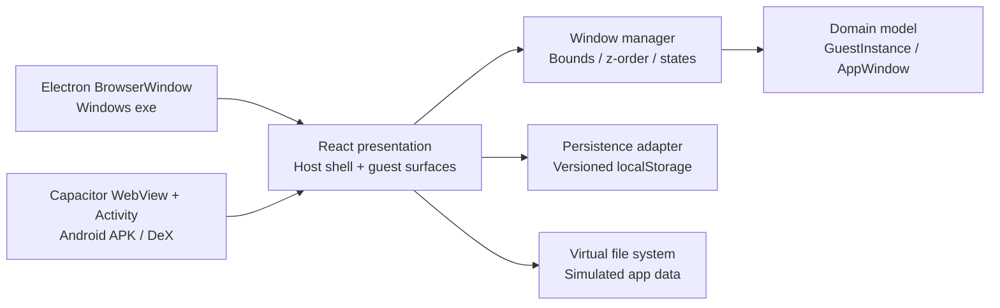

# TECHNICAL PROPOSAL: Cross-Platform Windows Desktop Emulator

## 1. Framework selection

### Decision: React + TypeScript + Vite, packaged by Electron for Windows and Capacitor for Android

VerWin is a **desktop environment simulation**, not a hypervisor. The hard problem is a dense, interactive compositor with many lightweight surfaces, not binary translation. A browser renderer is therefore an excellent fit: it gives us GPU-accelerated compositing, mature pointer/keyboard events, accessibility primitives, and one renderer that can be shipped in both a Windows executable and an Android APK.

The project uses:

- **React 18 + TypeScript** for component isolation and compile-time contracts.
- **Vite** for a small, fast production bundle and the same `dist/` output on every platform.
- **Electron** for the Windows `.exe`. Its hardened BrowserWindow is the native desktop shell, while the renderer remains browser-compatible.
- **Capacitor 7** for Android. Capacitor produces a native Android Activity/WebView APK without forking the UI. The Android host is where resizeability, density, configuration changes, and DeX behavior are declared.
- **lucide-react** for permissively licensed host icons. Era-specific guest glyphs are CSS/text primitives rather than copied Microsoft artwork.
- **Vitest** for deterministic domain tests.

Flutter was considered. It provides excellent desktop and Android rendering, but would require introducing Dart and a second native window integration strategy for the Android DeX configuration. `.NET MAUI` provides strong native controls but has less predictable, pixel-controlled composition for five intentionally different historical themes and a heavier toolchain. Electron alone cannot produce an Android APK, while Capacitor alone cannot provide a Windows native executable. The Electron + Capacitor pair keeps one renderer and only two small platform shells. Because guest apps are required to be independent surfaces *within* the host application rather than OS-level processes, React's absolutely positioned surfaces are the correct abstraction and are much lighter than spawning one native window per simulated app.

This is a deliberate trade-off: the Windows wrapper is larger than a native Flutter binary, but the simulated guests do not multiply the Electron process. Each guest is a DOM surface with no VM, filesystem worker, or hidden browser tab.

## 2. High-level architecture



The layers are intentionally small:

1. **Presentation** (`src/components`, `src/App.tsx`, CSS): only renders state and emits user intent. `WindowFrame` is the shared pointer-driven compositor primitive for both guest and app layers.
2. **Domain** (`src/domain`, `src/data`): version profiles, app metadata, bounds, window states, and geometry algorithms. It has no browser or Electron dependency.
3. **State/data** (`src/state`): immutable session actions and a versioned persistence boundary. Persistence is debounced so pointer moves do not synchronously block rendering.
4. **Platform shell** (`electron`, `android-template`): security policy and native packaging only. No guest behavior is duplicated here.

A guest crash is modeled as a surface-level failure boundary: app state is local to its guest record, and removing a guest only removes that subtree. There is no shared worker whose failure can take down other sessions. The debug console reports compositor and storage status without exposing host APIs to guest apps.

## 3. Windows version emulation strategy

A guest is a `GuestInstance` containing a version profile, persistent outer bounds, desktop state, z-index, Start menu state, and an array of `AppWindow` records. A profile contains era tokens rather than scattered conditionals: desktop wallpaper recipe, taskbar mode, accent, window color, radius, font stack, Start menu family, and taskbar alignment.

The visual strategy is intentionally recognizable instead of copying proprietary artwork:

- **95**: teal desktop, gray beveled controls, classic Start button, Tahoma/MS Sans Serif, zero-radius chrome.
- **XP**: blue/green gradient taskbar, Luna-like blue title bars, rounded Start menu, Tahoma, blue desktop gradient.
- **7**: translucent dark taskbar, Aero-like glass gradients, Segoe UI, luminous blue wallpaper.
- **10**: dark taskbar, blue accent, flat title bars, left Start layout and Segoe UI.
- **11**: rounded Fluent surfaces, translucent centered taskbar, centered Start menu, Segoe UI Variable fallback and blue/purple bloom wallpaper.

Included applications are real interactive simulations: Explorer navigates a deterministic virtual file list, Notepad persists text per app surface, Calculator evaluates basic operations, Paint stores pointer-drawn strokes, Settings switches pages, and the debug console shows runtime events. This makes the UI convincing without running Windows binaries or violating Windows distribution terms.

## 4. Window-management system

There are two compositor levels:

- **Host guest windows** live in `.emulator-stage`. Every guest is a positioned `WindowFrame` with a title bar, independent z-index, resize grip, and normal/minimized/maximized state.
- **Guest application windows** live in that guest's `.guest-workspace`. They use the same `WindowFrame` component, but their bounds and z-index belong only to the owning guest. An app therefore cannot accidentally appear in another version's taskbar or workspace.

Pointer gestures use `setPointerCapture`, so a mouse or a DeX stylus/touch pointer can leave the title bar during a drag without losing the gesture. Resize clamps to safe minimum dimensions. Bringing a surface forward increments a monotonic z-layer; minimizing removes the surface from the workspace and creates a button in the correct guest taskbar. Maximize changes layout to an inset fill without destroying normal bounds, so restore returns the prior position and size.

The local storage schema is `verwin.desktop.v1`. It stores only serializable records; app components do not store DOM references in it. The write is delayed by 180 ms, and malformed data is ignored. This provides session persistence while keeping pointer movement smooth.

## 5. Samsung DeX optimization

The Android Activity is explicitly resizeable, hardware accelerated, and does not require a touchscreen. Its configuration contract includes orientation, screen size, smallest screen size, keyboard visibility, screen layout, and `uiMode`, so a DeX switch can be handled without destroying the React session. The web renderer uses `pointer` events rather than touch-only handlers and recalculates its responsive layout from the available viewport. `src/App.tsx` marks a wide, fine-pointer Samsung/desktop viewport with `data-platform="dex"`; CSS increases the touch target/title bar dimensions and preserves a desktop workspace.

Native resources under `android-template/app/src/main/res/values-*` provide density-independent host spacing for handset, night, `sw600dp`, and wide DeX configurations. The exact manifest and ADB validation sequence are in `docs/android-dex.md`.

## 6. Build and deployment pipeline

```text
npm ci
  ├─ npm test                  domain/window manager regression suite
  ├─ npm run build             tsc + Vite production bundle
  ├─ npm run desktop:dist      Electron Builder portable + NSIS Windows artifacts
  └─ npm run android:sync      Capacitor copies the same dist into Android WebView
                                └─ Android Studio signs APK/AAB
```

CI should run Node 20 LTS, `npm ci`, `npm test`, and `npm run build` on Linux. Windows packaging runs on a Windows runner or local Windows machine. Android signing must use a keystore supplied through CI secrets, never committed to the repository. The current implementation does not pretend to produce a signed artifact without a developer keystore; the phase-two instructions show the exact command.

### Expected resource envelope

| workload | target | expected on a mid-range 2021 laptop / DeX tablet |
| --- | ---: | ---: |
| host + one idle guest | 60 FPS | 120–180 MB renderer memory |
| host + three idle guests | 30+ FPS | 300–430 MB renderer memory |
| three guests + 6 app surfaces | 30+ FPS | 360–520 MB renderer memory |
| Paint pointer stroke | <16 ms input frame | GPU composited SVG, no blocking I/O |

These are engineering budgets, not a measurement claim for every device. Use the profiling steps in `docs/build-and-test.md` before publishing a performance guarantee.
